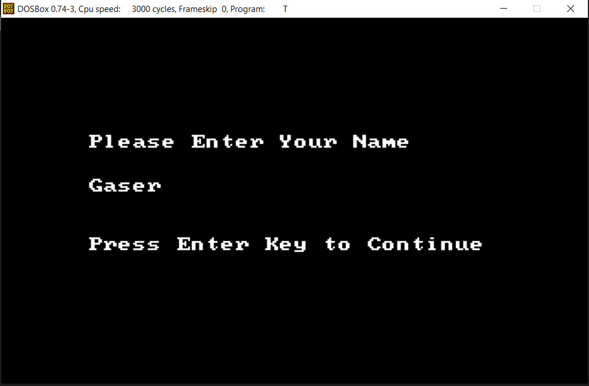
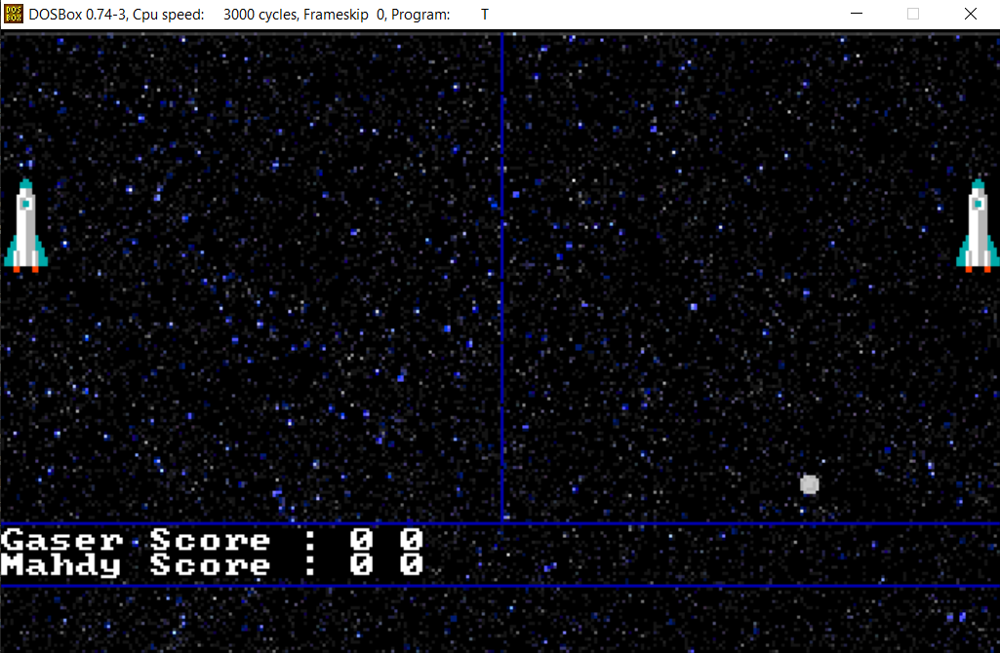
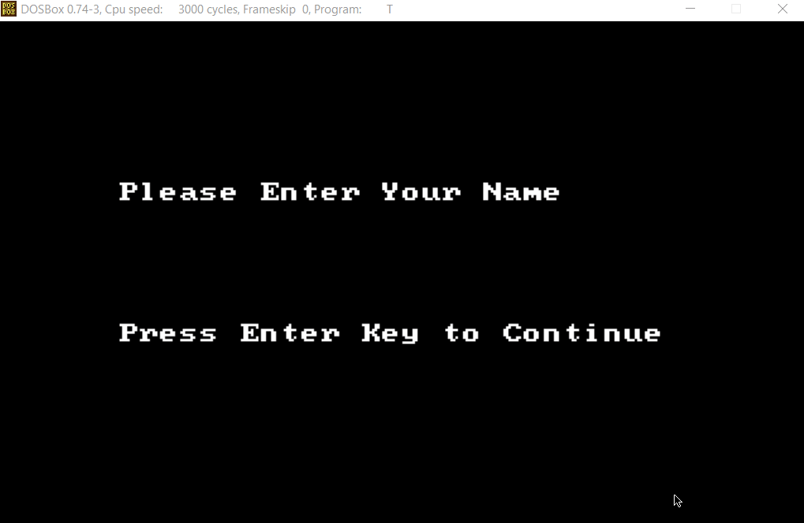

# Ping-pong

  

 Ping-pong.
      

  

## 📙 About 
A 2 players Assembly X86.

## 📷 Screenshots 

### ✨ Contributors
<table>
  <tr>
    <td align="center"><a href="https://github.com/We2Am-BaSsem"> <b>Weaam Bassem</b></a> </td>
    <td align="center"><a href="https://github.com/gaserashraf"> <b>Gaser Ashraf</b></a> </td>
     <td align="center"><a href="https://github.com/YousefElshabrawy"> <b>Yousef  Elshabrawy‬</b></a> </td>
     <td align="center"><a href="https://github.com/yousefelmahdy"> <b>Yousef Elmahdy</b></a> </td>
  </tr>
 </table>

